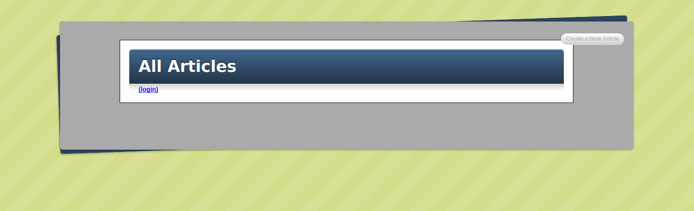

# Jumpstart Blogger 2 Project

This is a simple [blogger](https://en.wikipedia.org/wiki/Hangman_(game)) built with Ruby on Rails!

This is a project from [Jumpstart Lab](http://tutorials.jumpstartlab.com/projects/blogger.html) recommended by [The Odin Project](https://www.theodinproject.com/courses/web-development-101/lessons/ruby-on-rails)

## Post-Project Thoughts

This was a step-by-step tutorial, so I played minimal role in design. This was introduced in the Web Development 101 section of The Odin Project to give me a small taste of Rails. It was definitely confusing at times but I grew to partially understand some of the vocabulary and relationships.

I look forward to learning Rails one day.
